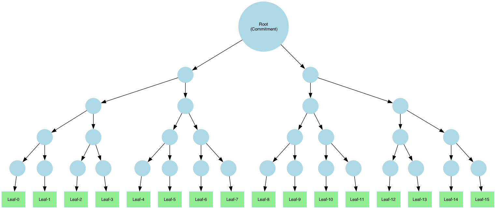
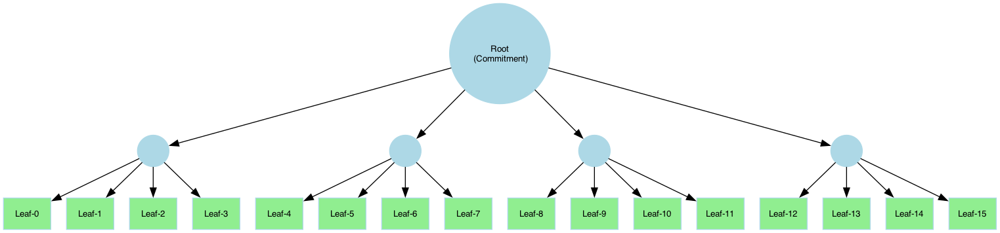
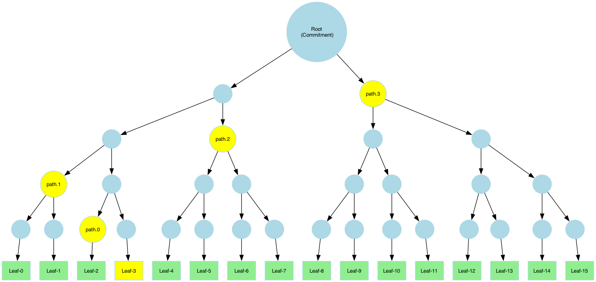
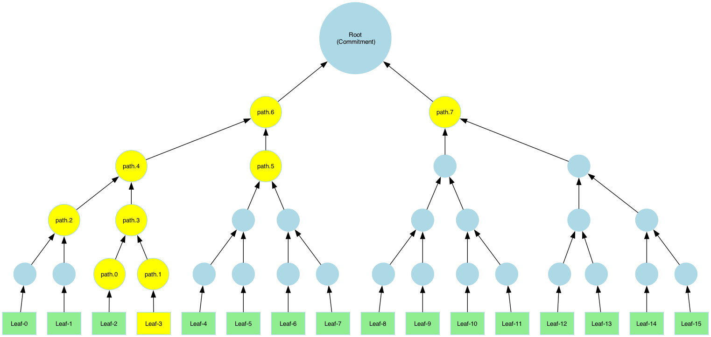

# Merkle Tree API Documentation (Golang)

This is the Golang version of the **Merkle Tree API Documentation** ([C++ documentation](../primitives/merkle.md)). It mirrors the structure and functionality of the C++ version, providing equivalent APIs in Golang.
For more detailed explanations, refer to the [C++ documentation](../primitives/merkle.md).

To see a complete implementation, visit the [Hash and Merkle example](https://github.com/ingonyama-zk/icicle/tree/main/examples/rust/hash-and-merkle) for a full example.

:::caution Warning

Using the Hash package requires `go` version 1.22

:::

## Tree Structure and Configuration in Golang

### Defining a Merkle Tree

```go
/// * `layerHashers` - A vector of hash objects representing the hashers of each layer.
/// * `leafElementSize` - Size of each leaf element.
/// * `outputStoreMinLayer` - Minimum layer at which the output is stored.
///
/// # Returns a new `MerkleTree` instance or EIcicleError.
func CreateMerkleTree(
  layerHashers []hash.Hasher,
  leafElementSize,
  outputStoreMinLayer uint64,
) (MerkleTree, runtime.EIcicleError)
```

The `outputStoreMinLayer` parameter defines the lowest layer that will be stored in memory. Layers below this value will not be stored, saving memory at the cost of additional computation when proofs are generated.

### Building the Tree

The Merkle tree can be constructed from input data of any type, allowing flexibility in its usage. The size of the input must align with the tree structure defined by the hash layers and leaf size. If the input size does not match the expected size, padding may be applied.

Refer to the [Padding Section](#padding) for more details on how mismatched input sizes are handled.

```go
/// * `mt` - The merkle tree object to build
/// * `leaves` - A slice of leaves (input data).
/// * `config` - Configuration for the Merkle tree.
///
/// # Returns a result indicating success or failure.
func BuildMerkleTree[T any](
  mt *MerkleTree,
  leaves core.HostOrDeviceSlice,
  cfg core.MerkleTreeConfig,
) runtime.EIcicleError
```

## Tree Examples in Golang

### Example A: Binary Tree

A binary tree with **5 layers**, using **Keccak-256**:



```go
import (
  "github.com/ingonyama-zk/icicle/v3/wrappers/golang/core"
  "github.com/ingonyama-zk/icicle/v3/wrappers/golang/hash"
  merkletree "github.com/ingonyama-zk/icicle/v3/wrappers/golang/merkle-tree"
)

leafSize := 1024
maxInputSize := leafSize * 16
input := make([]byte, maxInputSize)

hasher, _ := hash.NewKeccak256Hasher(uint64(leafSize))
compress, _ := hash.NewKeccak256Hasher(2 * hasher.OutputSize())
layerHashers := []hash.Hasher{hasher, compress, compress, compress, compress}

mt, _ := merkletree.CreateMerkleTree(layerHashers, uint64(leafSize), 0 /* min layer to store */)

merkletree.BuildMerkleTree[byte](&mt, core.HostSliceFromElements(input), core.GetDefaultMerkleTreeConfig())
```

### Example B: Tree with Arity 4



This example uses **Blake2s** in upper layers:

```go
// define layer hashers
// we want one hash layer to hash every 1KB to 32B then compress every 128B so only 2 more layers
hasher, _ := hash.NewKeccak256Hasher(uint64(leafSize))
compress, _ := hash.NewBlake2sHasher(2 * hasher.OutputSize())
layerHashers := []hash.Hasher{hasher, compress, compress,}

mt, _ := merkletree.CreateMerkleTree(layerHashers, uint64(leafSize), 0 /* min layer to store */)

merkletree.BuildMerkleTree[byte](&mt, core.HostSliceFromElements(input), core.GetDefaultMerkleTreeConfig())
```

## Padding

:::note
Padding feature is not yet supported in **v3.1** and is planned for **v3.2**.
:::

When the input for **layer 0** is smaller than expected, ICICLE can apply **padding** to align the data.

**Padding Schemes:**

1. **Zero padding:** Adds zeroes to the remaining space.
2. **Repeat last leaf:** The final leaf element is repeated to fill the remaining space.

```go
// type PaddingPolicy = int

// const (
//  NoPadding        PaddingPolicy = iota // No padding, assume input is correctly sized.
//  ZeroPadding                           // Pad the input with zeroes to fit the expected input size.
//  LastValuePadding                      // Pad the input by repeating the last value.
// )

import (
  "github.com/ingonyama-zk/icicle/v3/wrappers/golang/core"
)

config := core.GetDefaultMerkleTreeConfig();
config.PaddingPolicy = core.ZeroPadding;
merkletree.BuildMerkleTree[byte](&mt, core.HostSliceFromElements(input), core.GetDefaultMerkleTreeConfig())
```

## Root as Commitment

Retrieve the Merkle-root and serialize.

```go
/// Retrieve the root of the Merkle tree.
///
/// # Returns
/// A reference to the root hash.
func GetMerkleTreeRoot[T any](mt *MerkleTree) ([]T, runtime.EIcicleError)

commitment := merkletree.GetMerkleTreeRoot[byte](&mt)
fmt.Println!("Commitment:", commitment)
```

:::warning
The commitment can be serialized to the proof. This is not handled by ICICLE.
:::

## Generating Merkle Proofs

Merkle proofs are used to **prove the integrity of opened leaves** in a Merkle tree. A proof ensures that a specific leaf belongs to the committed data by enabling the verifier to reconstruct the **root hash (commitment)**.

A Merkle proof contains:

- **Leaf**: The data being verified.
- **Index** (leaf_idx): The position of the leaf in the original dataset.
- **Path**: A sequence of sibling hashes (tree nodes) needed to recompute the path from the leaf to the root.



```go
/// * `leaves` - A slice of leaves (input data).
/// * `leaf_idx` - Index of the leaf to generate a proof for.
/// * `pruned_path` - Whether the proof should be pruned.
/// * `config` - Configuration for the Merkle tree.
///
/// # Returns a `MerkleProof` object or eIcicleError
func GetMerkleTreeProof[T any](
  mt *MerkleTree,
  leaves core.HostOrDeviceSlice,
  leafIndex uint64,
  prunedPath bool,
  cfg core.MerkleTreeConfig,
) (MerkleProof, runtime.EIcicleError)
```

### Example: Generating a Proof

Generating a proof for leaf idx 5:

```go
mp, _ := merkletree.GetMerkleTreeProof[byte](
  &mt,
  core.HostSliceFromElements(input),
  5,     /* leafIndex */
  true, /* prunedPath */
  core.GetDefaultMerkleTreeConfig(),
)
```

:::warning
The Merkle-path can be serialized to the proof along with the leaf. This is not handled by ICICLE.
:::

## Verifying Merkle Proofs

```go
/// * `proof` - The Merkle proof to verify.
///
/// # Returns a result indicating whether the proof is valid.
func (mt *MerkleTree) Verify(mp *MerkleProof) (bool, runtime.EIcicleError)
```

### Example: Verifying a Proof

```go
isVerified, err := mt.Verify(&mp)
assert.True(isVerified)
```

## Pruned vs. Full Merkle-paths

A **Merkle path** is a collection of **sibling hashes** that allows the verifier to **reconstruct the root hash** from a specific leaf.
This enables anyone with the **path and root** to verify that the **leaf** belongs to the committed dataset.
There are two types of paths that can be computed:

- [**Pruned Path:**](#generating-merkle-proofs) Contains only necessary sibling hashes.
- **Full Path:** Contains all sibling nodes and intermediate hashes.



To compute a full path, specify `pruned=false`:

```go
mp, _ := merkletree.GetMerkleTreeProof[byte](
  &mt,
  core.HostSliceFromElements(input),
  5,     /* leafIndex */
  false, /*non-pruned is a full path --> note the pruned flag here*/
  core.GetDefaultMerkleTreeConfig(),
)
```

## Handling Partial Tree Storage

In cases where the **Merkle tree is large**, only the **top layers** may be stored to conserve memory.
When opening leaves, the **first layers** (closest to the leaves) are **recomputed dynamically**.

For example to avoid storing first layer we can define a tree as follows:

```go
mt, err := merkletree.CreateMerkleTree(layerHashers, leafSize, 1 /*min layer to store*/);
```
