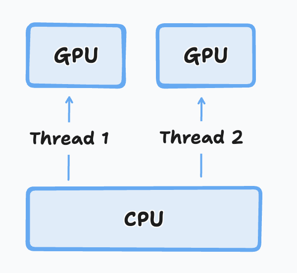

# Multi-Device with ICICLE

:::info
If you are looking for the Multi-Device API documentation refer [here](./rust-bindings/multi-gpu.md) for Rust and [here](./golang-bindings/multi-gpu.md) for Golang.
:::

One common challenge with Zero-Knowledge (ZK) computation is managing large input sizes. It's not uncommon to encounter circuits surpassing 2^25 constraints, which can push even the most advanced compute devices to their limits. To effectively scale and process such large circuits, leveraging multiple devices becomes a necessity.

Multi-Device programming involves developing software to operate across multiple GPUs, CPUs, or other specialized hardware devices. Let's first explore different approaches to Multi-Device programming, then we will cover how ICICLE allows you to easily develop your ZK computations to run across many devices.

## Approaches to Multi-Device Programming

There are many [different strategies](https://github.com/NVIDIA/multi-gpu-programming-models) available for implementing multi-device systems, but they can generally be split into two categories:

### Device Server Approach

This approach typically involves a single or multiple CPUs managing threads that read from and write to multiple devices, such as GPUs, CPUs, or accelerators. You can think of it as a scaled-up HOST-Device model.



This approach doesn't necessarily allow for tackling larger computation sizes, but it does enable the simultaneous computation of tasks that wouldn't fit on a single device.

For example, if you needed to compute two MSMs of size 2^26 on a GPU with 16GB of VRAM, you would normally have to perform these tasks asynchronously. However, by doubling the number of GPUs or other devices in your system, you can now run these computations in parallel.

### Inter-Device Approach

This more sophisticated approach involves leveraging technologies such as [GPUDirect, NCCL, NVSHMEM](https://www.nvidia.com/en-us/on-demand/session/gtcspring21-cwes1084/), NVLink, or other interconnect technologies to combine multiple devices and split a computation across different hardware.

This approach requires redesigning the algorithm at the software level to be compatible with splitting tasks among devices. In some cases, to minimize latency, special inter-device connections can be installed on a server to allow direct communication between multiple devices.

## Writing ICICLE Code for Multi-Device Setups

Currently, ICICLE adopts a Device Server approach, where we assume you have a machine with multiple devices (GPUs, CPUs, etc.) and wish to run computations on each device.

Each thread needs to set a device. Following api calls (including memory management and compute apis) will execute on that device, for this thread.

### C++
```cpp
// Set the device to CPU
Device device = "CPU"; 
icicle_set_device(device);
```
### Rust
```rust
// Set the device to the first CUDA GPU (GPU-0)
let device = icicle_runtime::Device::new("CUDA", 0 /* =device_id*/);
icicle_runtime::set_device(&device).unwrap();
```

### Go (TODO)

## Best Practices

- **Avoid Hardcoding Device IDs:** If you want your software to take full advantage of all available devices on a machine, use methods such as `icicle_get_device_count()` to support an arbitrary number of devices.
```cpp
/**
 * @brief Checks if the specified device is available.
 *
 * @param dev The device to check for availability.
 * @return eIcicleError Status of the device availability check.
 *         - `SUCCESS` if the device is available.
 *         - `INVALID_DEVICE` if the device is not available.
 */
extern "C" eIcicleError icicle_is_device_avialable(const Device& dev);

  /**
 * @brief Get number of available devices active device for thread
 *

 * @return eIcicleError Status of the device set
 */
extern "C" eIcicleError icicle_get_device_count(int& device_count /*OUT*/);
```
  
- **Launch One CPU Thread per Device:** To avoid [common errors](https://developer.nvidia.com/blog/cuda-pro-tip-always-set-current-device-avoid-multithreading-bugs/) and ensure code readability, we recommend creating a dedicated thread for each device. Within each CPU thread, you can launch as many tasks as you like for a device, as long as they all run on the same device ID. This will make your code more manageable, easier to read, and performant.
---

This guide provides an overview of multi-device support in ICICLE, explaining the approaches and best practices for efficiently scaling ZK computations across multiple devices. For further information or support, please refer to our [documentation](./) or join the discussion on [Discord](https://discord.gg/6vYrE7waPj).
