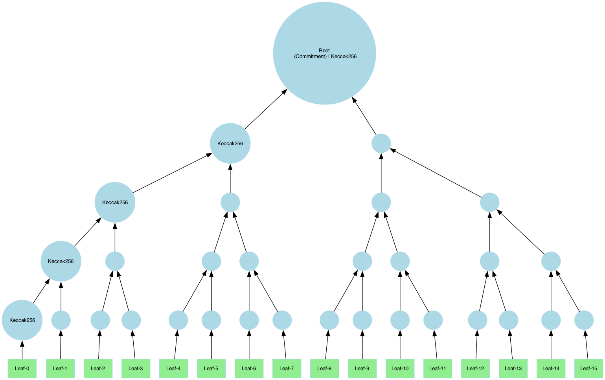

# Merkle Tree API Documentation

## What is a Merkle Tree?

A **Merkle tree** is a cryptographic data structure that allows for **efficient verification of data integrity**. It consists of:
- **Leaf nodes**, each containing a piece of data.
- **Internal nodes**, which store the **hashes of their child nodes**, make up the layers leading to the **root node** which is the cryptographic commitment.


## Tree Structure and Configuration

### Structure Definition

With ICICLE, you have the **flexibility** to build various tree topologies based on your needs. A tree is defined by:

1. **Hasher per layer** ([Link to Hasher API](./hash.md)) with a **default input size**.
2. **Size of a leaf element** (in bytes): This defines the **granularity** of the data used for opening proofs.

The **root node** is assumed to be a single node. The **height of the tree** is determined by the **number of layers**.
Each layer's **arity** is calculated as:

$$
{arity}_i = \frac{layers[i].inputSize}{layers[i-1].outputSize}
$$

For **layer 0**:

$$
{arity}_0 = \frac{layers[0].inputSize}{leafSize}
$$

:::note
Each layer has a shrinking-factor defined by $\frac{layer.outputSize}{layer.inputSize}$.
This factor is used to compute the input size, assuming a single root node.
:::

When dealing with very large Merkle trees, storing the entire tree can be memory-intensive. To manage this, ICICLE allows users to store only the upper layers of the tree while omitting the lower layers, which can be recomputed later as needed. This approach conserves memory but requires recomputing the omitted layers when generating Merkle proofs.


### Defining a Merkle Tree

```cpp
// icicle/merkle/merkle_tree.h
static MerkleTree create(
    const std::vector<Hash>& layer_hashers,
    uint64_t leaf_element_size,
    uint64_t output_store_min_layer = 0);
```

The `output_store_min_layer` parameter defines the lowest layer that will be stored in memory. Layers below this value will not be stored, saving memory at the cost of additional computation when proofs are generated.


### Building the Tree

The Merkle tree can be constructed from input data of any type, allowing flexibility in its usage. The size of the input must align with the tree structure defined by the hash layers and leaf size. If the input size does not match the expected size, padding may be applied.

Refer to the [Padding Section](#padding) for more details on how mismatched input sizes are handled.

```cpp
// icicle/merkle/merkle_tree.h
inline eIcicleError build(
    const std::byte* leaves,
    uint64_t leaves_size,
    const MerkleTreeConfig& config);

template <typename T>
inline eIcicleError build(
    const T* leaves,
    uint64_t nof_leaves,
    const MerkleTreeConfig& config);
```


## Tree Examples

### Example A: Binary Tree

A binary tree with **5 layers**, using **Keccak-256**:



```cpp
const uint64_t leaf_size = 1024;
// Allocate a dummy input. It can be any type as long as the total size matches.
const uint32_t max_input_size = leaf_size * 16;
auto input = std::make_unique<uint64_t[]>(max_input_size / sizeof(uint64_t));

// Define hashers
auto hash = Keccak256::create(leaf_size); // hash 1KB -> 32B
auto compress = Keccak256::create(2 * hasher.output_size()); // hash every 64B to 32B

// Construct the tree using the layer hashers and leaf-size
std::vector<Hash> hashers = {hasher, compress, compress, compress, compress};
auto merkle_tree = MerkleTree::create(hashers, leaf_size);

// compute the tree
merkle_tree.build(input.get(), max_input_size / sizeof(uint64_t), default_merkle_tree_config());
```


### Example B: Tree with Arity 4

This example uses **Blake2s** in the upper layer:


```cpp
#include "icicle/merkle/merkle_tree.h"

const uint64_t leaf_size = 1024;
const uint32_t max_input_size = leaf_size * 16;
auto input = std::make_unique<uint64_t[]>(max_input_size / sizeof(uint64_t));

// note here we use Blake2S for the upper layer
auto hash = Keccak256::create(leaf_size);
auto compress = Blake2s::create(4 * hash.output_size());

std::vector<Hash> hashers = {hash, compress, compress};
auto merkle_tree = MerkleTree::create(hashers, leaf_size);

merkle_tree.build(input.get(), max_input_size / sizeof(uint64_t), default_merkle_tree_config());
```

:::note
Any combination of hashers is valid including **Poseidon** that computes on field elements.
:::


## Padding

:::note
Padding feature is not yet supported in **v3.1** and is planned for **v3.2**.
:::

When the input for **layer 0** is smaller than expected, ICICLE can apply **padding** to align the data.

**Padding Schemes:**
1. **Zero padding:** Adds zeroes to the remaining space.
2. **Repeat last leaf:** The final leaf element is repeated to fill the remaining space.

```cpp
auto config = default_merkle_tree_config();
config.padding_policy = PaddingPolicy::ZeroPadding;
merkle_tree.build(input.get(), max_input_size / sizeof(uint64_t), config);
```


## Root as Commitment

Retrieve the Merkle-root and serialize.

```cpp
/**
 * @brief Returns a pair containing the pointer to the root (ON HOST) data and its size.
 * @return A pair of (root data pointer, root size).
 */
inline std::pair<const std::byte*, size_t> get_merkle_root() const;

auto [commitment, size] = merkle_tree.get_merkle_root();
serialize_commitment_application_code(...);
```

:::warning
The commitment can be serialized to the proof. This is not handled by ICICLE.
:::


## Generating Merkle Proofs

Merkle proofs are used to **prove the integrity of opened leaves** in a Merkle tree. A proof ensures that a specific leaf belongs to the committed data by enabling the verifier to reconstruct the **root hash (commitment)**.

A Merkle proof contains:

- **Leaf**: The data being verified.
- **Index** (leaf_idx): The position of the leaf in the original dataset.
- **Path**: A sequence of sibling hashes (tree nodes) needed to recompute the path from the leaf to the root.


```cpp
// icicle/merkle/merkle_proof.h
class MerkleProof {
    // Represents the Merkle proof with leaf, root, and path data.
};
```

### Example: Generating a Proof

Generating a proof for leaf idx 3:

```cpp
MerkleProof proof{};
auto err = merkle_tree.get_merkle_proof(
    input.get(),
    max_input_size / sizeof(uint64_t),
    3 /*leaf-idx*/, true,
    default_merkle_tree_config(), proof);

auto [_leaf, _leaf_size, _leaf_idx] = proof.get_leaf();
auto [_path, _path_size] = proof.get_path();
```

:::warning
The Merkle-path can be serialized to the proof along with the leaf. This is not handled by ICICLE.
:::


## Verifying Merkle Proofs

```cpp
/**
 * @brief Verify an element against the Merkle path using layer hashers.
 * @param merkle_proof The MerkleProof object includes the leaf, path, and the root.
 * @param valid output valid bit. True if the proof is valid, false otherwise.
 */
eIcicleError verify(const MerkleProof& merkle_proof, bool& valid) const
```

### Example: Verifying a Proof

```cpp
bool valid = false;
auto err = merkle_tree.verify(proof, valid);
```


## Pruned vs. Full Merkle-paths

A **Merkle path** is a collection of **sibling hashes** that allows the verifier to **reconstruct the root hash** from a specific leaf.
This enables anyone with the **path and root** to verify that the **leaf** belongs to the committed dataset.
There are two types of paths that can be computed:

- [**Pruned Path:**](#generating-merkle-proofs) Contains only necessary sibling hashes.
- **Full Path:** Contains all sibling nodes and intermediate hashes.


To compute a full path, specify `pruned=false`:

```cpp
MerkleProof proof{};
auto err = merkle_tree.get_merkle_proof(
    input.get(),
    max_input_size / sizeof(uint64_t),
    3 /*leaf-idx*/, false /*=pruned*/,  // --> note the pruned flag here
    default_merkle_tree_config(), proof);
```


## Handling Partial Tree Storage

In cases where the **Merkle tree is large**, only the **top layers** may be stored to conserve memory.
When opening leaves, the **first layers** (closest to the leaves) are **recomputed dynamically**.

For example to avoid storing first layer we can define a tree as follows:

```cpp
const int min_layer_to_store = 1;
auto merkle_tree = MerkleTree::create(hashers, leaf_size, min_layer_to_store);
```
