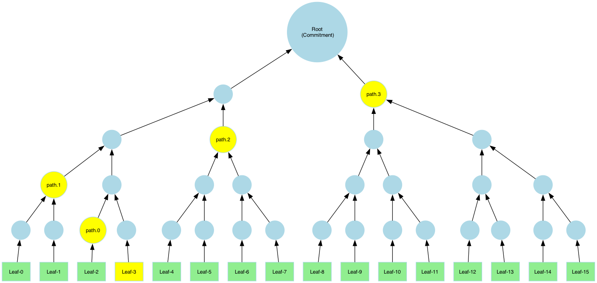
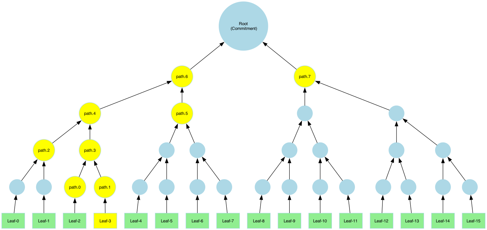

# Merkle Tree API Documentation

## What is a Merkle Tree?

A **Merkle tree** is a cryptographic data structure that allows for **efficient verification of data integrity**. It consists of:
- **Leaf nodes**, each containing a piece of data.
- **Internal nodes**, which store the **hashes of their child nodes**, leading up to the **root node** (the cryptographic commitment).

With ICICLE, you have the **flexibility** to build various tree topologies based on your needs. The user must define:

1. **Hasher per layer** ([Link to Hasher API](./hash.md)) with a **default input size**.
2. **Size of a leaf element** (in bytes): This defines the **granularity** of the data used for opening proofs.

### Tree Structure

It is assumed that the **root node** is a single node. The **height of the tree** is determined by the **number of layers** specified by the user.  
Each layer has its own **arity**, calculated as:

$$
{arity}_i = \frac{layers[i].inputSize}{layer[i-1].outputSize}
$$

and for layer 0:

$$
{arity}_0 = \frac{layers[0].inputSize}{leafSize}
$$

#### Define a Merkle-Tree

```cpp
// icicle/merkle/merkle_tree.h
/**
 * @brief Static factory method to create a MerkleTree instance.
 *
 * @param layer_hashes A vector of Hash objects representing the hashes of each tree layer.
 * @param leaf_element_size Size of each leaf element.
 * @param output_store_min_layer Minimum layer at which output is stored (default is 0).
 * @return A MerkleTree object initialized with the specified backend.
 */
static MerkleTree
create(const std::vector<Hash>& layer_hashes, uint64_t leaf_element_size, uint64_t output_store_min_layer = 0);
```

#### Build the tree

```cpp
// icicle/merkle/merkle_tree.h
/**
 * @brief Build the Merkle tree from the provided leaves.
 * @param leaves Pointer to the leaves of the tree (input data).
 * @param leaves_size The size of the leaves in bytes.
 * @param config Configuration for the Merkle tree operation.
 * @return Error code of type eIcicleError indicating success or failure.
 */
inline eIcicleError build(const std::byte* leaves, uint64_t leaves_size, const MerkleTreeConfig& config);

/**
 * @brief Build the Merkle tree from the provided leaves.
 * @param leaves Pointer to the leaves of the tree (input data).
 * @param nof_leaves Number of T elements in leaves
 * @param config Configuration for the Merkle tree operation.
 * @return Error code of type eIcicleError indicating success or failure.
 */
template <typename T>
inline eIcicleError
build(const T* leaves, uint64_t nof_leaves /* number of leaf elements */, const MerkleTreeConfig& config)
```


#### Tree example A

- The simplest example is a binary tree. In this example we have a tree with 5 layers, thus 5 layer hashes.
- The first layer is hashing every leaf to a single tree node.
- The following layers concatenate and hash every two nodes from the previous layer.


To define such as tree in ICICLE, let's use Blake2s for all layers. Leaves will be defined as 1KB.
So we expect up-to 16KB of input then we will be able to open a 1KB chunk and prove its inclusion in the committed data.

```cpp
// Define leaf size
const uint64_t leaf_size = 1024;
// Allocate a dummy input. It can be any type as long as the total size matches.
using T = uint64_t;
const uint32_t max_input_size = leaf_size * 16;
auto input = std::make_unique<T[]>(max_input_size / sizeof(T));

// Define layer hashes. Keccak-256 is used to hash 1KB chunks, followed by hashing every two nodes (64B).
auto layer0_hasher = Keccak256::create(leaf_size/*=default input size*/);
auto next_layer_hasher = Keccak256::create(2 * layer0_hasher.output_size() /*=default input size*/);

std::vector<Hash> hashes = {layer0_hasher, next_layer_hasher, next_layer_hasher, next_layer_hasher, next_layer_hasher};
auto merkle_tree = MerkleTree::create(hashes, leaf_size);

// Build the tree with input data
merkle_tree.build(input.get(), max_input_size, default_merkle_tree_config());
```

#### Tree example B

In this example, we build a tree with **arity 4** using **Blake2s** for the upper layers.


```cpp
// Define leaf size
const uint64_t leaf_size = 1024;
using T = uint64_t;
const uint32_t max_input_size = leaf_size * 16;
auto input = std::make_unique<T[]>(max_input_size / sizeof(T));

// Define hashes. Layer 0 uses Keccak-256, and Blake2s is used in higher layers with arity 4.
auto layer0_hasher = Keccak256::create(leaf_size /*=default input size*/);
auto next_layer_hasher = Blake2s::create(4 * layer0_hasher.output_size() /*=default input size*/);

std::vector<Hash> hashes = {layer0_hasher, next_layer_hasher};
auto merkle_tree = MerkleTree::create(hashes, leaf_size);

// Build the tree with input data
merkle_tree.build(input.get(), max_input_size / sizeof(T), default_merkle_tree_config());
```

---

## Padding

:::note  
This feature is not yet supported in **v3.1** and will be available in **v3.2**.  
:::

When the input for **layer 0** is smaller than expected, ICICLE can apply **padding** to align the data.

**Padding Schemes:**
1. **Zero padding:** Adds zeroes to the remaining space.
2. **Repeat last leaf:** The final leaf element is repeated to fill the remaining space.

This is defined via the Merkle-tree config options:

```cpp
auto config = default_merkle_tree_config();
config.padding_policy = PaddingPolicy::ZeroPadding;
merkle_tree.build(input.get(), max_input_size / sizeof(T), config);
```

---

## Root as Commitment

```cpp
/**
 * @brief Returns a pair containing the pointer to the root (ON HOST) data and its size.
 * @return A pair of (root data pointer, root size).
 */
inline std::pair<const std::byte*, size_t> get_merkle_root() const;

template <typename T>
inline std::pair<T*, size_t> get_merkle_root() const;
```

The **root of the Merkle tree** acts as a **cryptographic commitment** to the entire dataset.

```cpp
// Retrieve the root as an array of bytes
auto [commitment, size] = merkle_tree.get_merkle_root();
```

---

## Proof of Inclusion via Merkle Paths

A merkle-proof object is generated per leaf. 
```cpp
// icicle/merkle/merkle_proof.h
/**
 * @brief Represents a Merkle proof with leaf, root, and path data.
 *
 * This class encapsulates the Merkle proof, managing the leaf, root, and path as byte arrays.
 * It provides functionality to allocate, copy, and access these components, supporting both
 * raw byte manipulation and type-safe access via templates.
 */
class MerkleProof{/*...*/};
```

This object represents the leaf, the merkle-path and the merkle-root. It can be serialized or verified by a tree similar to the one used to generate the proof.

To generate it:

```cpp
// icicle/merkle/merkle_tree.h
/**
 * @brief Retrieve the Merkle path for a specific element.
 * @param leaves Pointer to the leaves of the tree.
 * @param leaves_size The size of the leaves in bytes.
 * @param leaf_idx Index of the element for which the Merkle path is required.
 * @param is_pruned If set, the path will not include hash results that can be extracted from siblings
 * @param config Configuration for the Merkle tree operation.
 * @param merkle_proof Reference to the MerkleProof object where the path will be stored.
 * @return Error code of type eIcicleError.
 */
inline eIcicleError get_merkle_proof(
    const std::byte* leaves,
    uint64_t leaves_size,
    uint64_t leaf_idx,
    bool is_pruned,
    const MerkleTreeConfig& config,
    MerkleProof& merkle_proof /*output*/) const

/**
 * @brief Retrieve the Merkle path for a specific element.
 * @param leaves Pointer to the leaves of the tree.
 * @param nof_leaves Number of T elements in leaves
 * @param leaf_idx Index of the element for which the Merkle path is required.
 * @param is_pruned If set, the path will not include hash results that can be extracted from siblings
 * @param config Configuration for the Merkle tree operation.
 * @param merkle_proof Reference to the MerkleProof object where the path will be stored.
 * @return Error code of type eIcicleError.
 */
template <typename T>
inline eIcicleError get_merkle_proof(
    const T* leaves,
    uint64_t nof_leaves,
    uint64_t leaf_idx,
    bool is_pruned,
    const MerkleTreeConfig& config,
    MerkleProof& merkle_proof /*output*/) const
```

A **Merkle path** is a collection of **sibling hashes** that allows the verifier to **reconstruct the root hash** from a specific leaf.  
This enables anyone with the **path and root** to verify that the **leaf** belongs to the committed dataset.

To open 'Leaf-3' we generate the following Merkle-path as a proof that proves this leaf is consistent with the commitment (the Merkle-root).



```cpp
MerkleProof proof{};
auto err = merkle_tree.get_merkle_proof(
input.get(), max_input_size / sizeof(T), 3 /* leaf idx to open*/, true /*=pruned path*/,
default_merkle_tree_config(), proof);

auto [_leaf, _leaf_size, _leaf_idx] = proof.get_leaf();
auto [_path, _path_size] = proof.get_path();
```

The path can be serialized but this outside of the scope of ICICLE.

---

## Pruned vs. Full Paths

- **Pruned Path:** Includes only the necessary sibling hashes.
- **Full Path:** Contains all sibling nodes and intermediate hashes.



```cpp
  // simply ask for a non-pruned path to get a full path. Its size will be larger accordingly.
  MerkleProof proof{};
  auto err = merkle_tree.get_merkle_proof(
    input.get(), max_input_size / sizeof(T), 3 /* leaf idx to open*/, false /*=pruned path*/,
    default_merkle_tree_config(), proof);
```

---

## Verifying Merkle Proofs

```cpp
// icicle/merkle/merkle_tree.h
/**
 * @brief Verify an element against the Merkle path using layer hashes.
 * @param merkle_proof The MerkleProof object includes the leaf, path, and the root.
 * @param valid output valid bit. True if the Proof is valid, false otherwise.
 * @return Error code of type eIcicleError indicating success or failure.
 */
eIcicleError verify(const MerkleProof& merkle_proof, bool& valid /*output*/) const
```

To **verify a Merkle proof**, the verifier:

1. Uses the **leaf** and the provided **path** to **recompute the hashes** along the path.
2. If the **computed root** matches the provided commitment, the **proof is valid**.

:::note  
The verification **reuses the Merkle tree** since it needs to know the hash functions and configurations, which are defined by the tree itself.  
:::

```cpp
bool valid = false;
auto err = merkle_tree.verify(proof, valid);
```

---

## Handling Partial Tree Storage

In cases where the **Merkle tree is large**, only the **top layers** may be stored to conserve memory.  
When opening leaves, the **first layers** (closest to the leaves) are **recomputed dynamically**.

For example to avoid storing first layer we can define a tree as follows:

```cpp
const int min_layer_to_store = 1;
auto merkle_tree = MerkleTree::create(hashes, leaf_size, min_layer_to_store);
```
