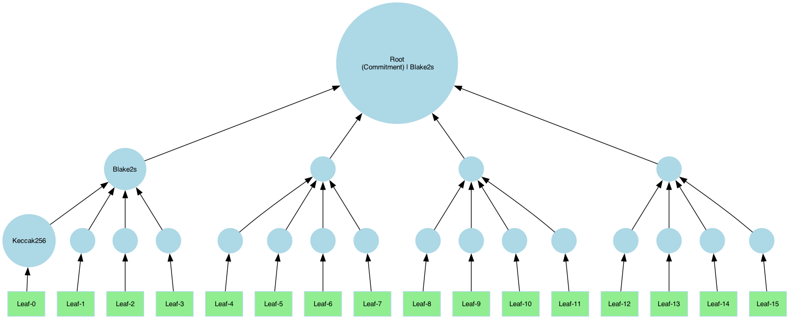

# Merkle Tree API Documentation

## What is a Merkle Tree?

A **Merkle tree** is a cryptographic data structure that allows for **efficient verification of data integrity**. It consists of:
- **Leaf nodes**, each containing a piece of data.
- **Internal nodes**, which store the **hashes of their child nodes**, leading up to the **root node** (the cryptographic commitment).

With ICICLE, you have the **flexibility** to build various tree topologies based on your needs. The user must define:

1. **Hasher per layer** ([Link to Hasher API](./hash.md)) with a **default input size**.
2. **Size of a leaf element** (in bytes): This defines the **granularity** of the data used for opening proofs.

---

## Tree Structure and Configuration

### Structure Definition

The **root node** is assumed to be a single node. The **height of the tree** is determined by the **number of layers**.  
Each layer's **arity** is calculated as:

$$
{arity}_i = \frac{layers[i].inputSize}{layer[i-1].outputSize}
$$

For **layer 0**:

$$
{arity}_0 = \frac{layers[0].inputSize}{leafSize}
$$

---

### Defining a Merkle Tree

```cpp
// icicle/merkle/merkle_tree.h
static MerkleTree create(
    const std::vector<Hash>& layer_hashes, 
    uint64_t leaf_element_size, 
    uint64_t output_store_min_layer = 0);
```

---

### Building the Tree

```cpp
// icicle/merkle/merkle_tree.h
inline eIcicleError build(
    const std::byte* leaves, 
    uint64_t leaves_size, 
    const MerkleTreeConfig& config);

template <typename T>
inline eIcicleError build(
    const T* leaves, 
    uint64_t nof_leaves, 
    const MerkleTreeConfig& config);
```

---

## Tree Examples

### Example A: Binary Tree

A binary tree with **5 layers**, using **Keccak-256**:


```cpp
const uint64_t leaf_size = 1024;
// Allocate a dummy input. It can be any type as long as the total size matches.
const uint32_t max_input_size = leaf_size * 16;
auto input = std::make_unique<uint64_t[]>(max_input_size / sizeof(uint64_t));

// Define hasher
auto layer0_hasher = Keccak256::create(leaf_size); // hash 1KB -> 32B
auto next_layer_hasher = Keccak256::create(2 * layer0_hasher.output_size()); // hash every 64B to 32B

// Construct the tree using the layer hashes and leaf-size
std::vector<Hash> hashes = {layer0_hasher, next_layer_hasher, next_layer_hasher, next_layer_hasher, next_layer_hasher};
auto merkle_tree = MerkleTree::create(hashes, leaf_size);

// compute the tree
merkle_tree.build(input.get(), max_input_size / sizeof(uint64_t), default_merkle_tree_config());
```

---

### Example B: Tree with Arity 4

This example uses **Blake2s** in the upper layer:



```cpp
#include "icicle/merkle/merkle_tree.h"

const uint64_t leaf_size = 1024;
const uint32_t max_input_size = leaf_size * 16;
auto input = std::make_unique<uint64_t[]>(max_input_size / sizeof(uint64_t));

// note here we use Blake2S for the upper layer
auto layer0_hasher = Keccak256::create(leaf_size);
auto next_layer_hasher = Blake2s::create(4 * layer0_hasher.output_size());

std::vector<Hash> hashes = {layer0_hasher, next_layer_hasher};
auto merkle_tree = MerkleTree::create(hashes, leaf_size);

merkle_tree.build(input.get(), max_input_size / sizeof(uint64_t), default_merkle_tree_config());
```

:::note
Any combination of hashes is valid including **Poseidon** that computes on field elements.
:::

---

## Padding

:::note  
This feature is not yet supported in **v3.1** and will be available in **v3.2**.  
:::

When the input for **layer 0** is smaller than expected, ICICLE can apply **padding** to align the data.

**Padding Schemes:**
1. **Zero padding:** Adds zeroes to the remaining space.
2. **Repeat last leaf:** The final leaf element is repeated to fill the remaining space.

```cpp
auto config = default_merkle_tree_config();
config.padding_policy = PaddingPolicy::ZeroPadding;
merkle_tree.build(input.get(), max_input_size / sizeof(uint64_t), config);
```

---

## Root as Commitment

```cpp
/**
 * @brief Returns a pair containing the pointer to the root (ON HOST) data and its size.
 * @return A pair of (root data pointer, root size).
 */
inline std::pair<const std::byte*, size_t> get_merkle_root() const;

auto [commitment, size] = merkle_tree.get_merkle_root();
```

:::note
The commitment can be serialized to the proof.
:::
---

## Generating Merkle Proofs

### Definition

```cpp
// icicle/merkle/merkle_proof.h
class MerkleProof {
    // Represents the Merkle proof with leaf, root, and path data.
};
```

### Example: Generating a Proof

Generating a proof for leaf idx 3:

```cpp
MerkleProof proof{};
auto err = merkle_tree.get_merkle_proof(
    input.get(), 
    max_input_size / sizeof(uint64_t), 
    3 /*leaf-idx*/, true, 
    default_merkle_tree_config(), proof);

auto [_leaf, _leaf_size, _leaf_idx] = proof.get_leaf();
auto [_path, _path_size] = proof.get_path();
```

:::note
The Merkle-path can be serialized to the proof along the leaf.
:::

---

## Verifying Merkle Proofs

```cpp
/**
 * @brief Verify an element against the Merkle path using layer hashes.
 * @param merkle_proof The MerkleProof object includes the leaf, path, and the root.
 * @param valid output valid bit. True if the proof is valid, false otherwise.
 */
eIcicleError verify(const MerkleProof& merkle_proof, bool& valid) const;

bool valid = false;
auto err = merkle_tree.verify(proof, valid);
```

---

## Pruned vs. Full Paths

A **Merkle path** is a collection of **sibling hashes** that allows the verifier to **reconstruct the root hash** from a specific leaf.  
This enables anyone with the **path and root** to verify that the **leaf** belongs to the committed dataset. 
There are two types of paths that can be computed:

- **Pruned Path:** Contains only necessary sibling hashes.


```cpp
MerkleProof proof{};
auto err = merkle_tree.get_merkle_proof(
    input.get(), 
    max_input_size / sizeof(uint64_t), 
    3 /*leaf-idx*/, true /*=pruned*/,  // --> note the pruned flag here
    default_merkle_tree_config(), proof);
```
- **Full Path:** Contains all sibling nodes and intermediate hashes.


```cpp
MerkleProof proof{};
auto err = merkle_tree.get_merkle_proof(
    input.get(), 
    max_input_size / sizeof(uint64_t), 
    3 /*leaf-idx*/, false /*=pruned*/,  // --> note the pruned flag here
    default_merkle_tree_config(), proof);
```

---

## Handling Partial Tree Storage

In cases where the **Merkle tree is large**, only the **top layers** may be stored to conserve memory.  
When opening leaves, the **first layers** (closest to the leaves) are **recomputed dynamically**.

For example to avoid storing first layer we can define a tree as follows:

```cpp
const int min_layer_to_store = 1;
auto merkle_tree = MerkleTree::create(hashes, leaf_size, min_layer_to_store);
```
