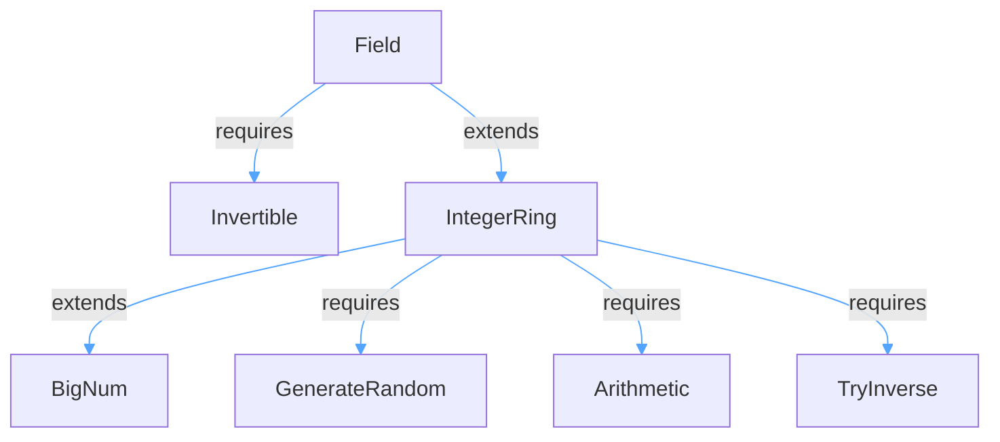

# Migration from ICICLE v3 to v4

ICICLE v4 introduces a more intuitive and object-oriented C++ API for field elements, making code more readable and maintainable. This guide will assist you in transitioning from ICICLE v3 to v4 by highlighting the key changes and providing examples for both C++ and Rust.

## Key Conceptual Changes

- **Object-Oriented Field API**: In v3, field operations were performed using static methods on the field type (e.g., `FF::sqr(a)`). In v4, these operations are now instance methods on the field elements themselves (e.g., `a.sqr()`), making the code more natural and readable.
  
- **Method Chaining**: The new API supports method chaining, allowing you to write more concise and expressive code by chaining multiple operations together.

## Migration Guide for C++

### Replacing Static Method Calls with Instance Methods

In ICICLE v4, static method calls on field types have been replaced with instance methods on field elements. This change makes the code more intuitive and follows object-oriented principles.

#### Field Arithmetic Operations

| v3 (Static Methods) | v4 (Instance Methods) |
|---------------------|----------------------|
| `FF::add(a, b)` | `a + b` |
| `FF::sub(a, b)` | `a - b` |
| `FF::mul(a, b)` | `a * b` |
| `FF::sqr(a)` | `a.sqr()` |
| `FF::neg(a)` | `a.neg()` |
| `FF::inverse(a)` | `a.inverse()` |
| `FF::pow(a, exp)` | `a.pow(exp)` |

#### Montgomery Conversion

| v3 (Static Methods) | v4 (Instance Methods) |
|---------------------|----------------------|
| `FF::to_montgomery(a)` | `a.to_montgomery()` |
| `FF::from_montgomery(a)` | `a.from_montgomery()` |

### Example Migration

**v3 (Static Methods):**
```cpp
FF a = FF::from(5);
FF b = FF::from(10);
FF c = FF::add(a, b);
FF d = FF::mul(c, FF::from(2));
FF e = FF::sqr(d);
FF f = FF::inverse(e);
```

**v4 (Instance Methods):**
```cpp
FF a = FF::from(5);
FF b = FF::from(10);
FF c = a.add(b);  // or a + b
FF d = c.mul(FF::from(2));  // or c * FF::from(2)
FF e = d.sqr();
FF f = e.inverse();
```

**v4 (Method Chaining):**
```cpp
FF result = FF::from(5)
    .add(FF::from(10))
    .mul(FF::from(2))
    .sqr()
    .inverse();
```

## Migration Guide for Rust

### New Trait design and Hierarchy

The v4 Rust wrappers introduce a three-layer abstraction; each layer builds on the one below and is wired up through a dedicated macro.


Layer breakdown

* **BigNum\<N\>** – fixed-width big integer with N 32-bit limbs. Generated by `impl_bignum!`; provides endian conversions, formatting helpers and FFI glue.
* **IntegerRing** = `BigNum + GenerateRandom + Arithmetic + TryInverse`. Adds ring arithmetic, random sampling and modular inverse. Generated by `impl_integer_ring!`.
* **Field** = `IntegerRing + Invertible`. Guarantees multiplicative inverses. Generated by `impl_field!`.

Creating a new field is usually a one-liner:

```rust
impl_field!(BLS12_381_Fr, "bls12_381_fr", 8);
```


This design replaces the older `FieldCfg`/`FieldImpl` pairing from v3 and offers finer-grained composability.

### Arithmetic API

ICICLE v4 implements field arithmetic operations through the `Arithmetic` trait and standard Rust operators. This makes the code more idiomatic and easier to read.

#### Field Arithmetic Operations

| (Static Methods) | (Instance Methods) | (Operators) |
|---------------------|----------------------|----------------|
| `Fr::add(a, b)` | `a.add(b)` | `a + b` |
| `Fr::sub(a, b)` | `a.sub(b)` | `a - b` |
| `Fr::mul(a, b)` | `a.mul(b)` | `a * b` |
| `Fr::sqr(a)` | `a.sqr()` | N/A |
| `Fr::neg(a)` | `a.neg()` | `-a` |
| `Fr::inv(a)` | `a.inv()` | N/A |
| `Fr::pow(a, exp)` | `a.pow(exp)` | N/A |

#### The Arithmetic Trait

The `Arithmetic` trait in ICICLE v4 is defined as follows:

```rust
pub trait Arithmetic: Sized + Add<Output = Self> + Sub<Output = Self> + Mul<Output = Self> {
    fn sqr(&self) -> Self;
    fn pow(&self, exp: usize) -> Self;
}
```

This trait extends the standard Rust operators (`Add`, `Sub`, `Mul`) and adds specialized field operations like square, inverse, and exponentiation.

#### The Invertible Trait

Field inversion is now provided by the `Invertible` trait. This trait defines a single method, `inv`, which returns the multiplicative inverse of a field element.

```rust
pub trait Invertible: Sized {
    fn inv(&self) -> Self;
}
```

If the field element is zero, the function will return zero.

### Renaming of the `FieldImpl` Trait

`FieldImpl` was renamed into `BigNum`

### Refactor Program from Vecops to Program module

In v4, the Program API has been moved from VecOps to a dedicated Program module for better organization and type safety.

#### Create program
- **v3 (VecOps):** `Fr::create_program(|symbols| { ... }, nof_params)?`
- **v4 (Program):** `FieldProgram::new(|symbols| { ... }, nof_params)?`

#### Execute program
- **v3 (VecOps):** `Fr::execute_program(&program, &mut vec_data, &config)?`
- **v4 (Program):** `program.execute_program(&mut vec_data, &config)?`

#### Create returning value program
- **v4:** `ReturningValueProgram::new(|symbols| -> symbol { ... }, nof_params)?`

#### Create predefined program
- **v3 (VecOps):** `Fr::create_predefined_program(pre_def)?`
- **v4 (Program):** `FieldProgram::new_predefined(pre_def)?`

#### Imports
- **v3 (VecOps):** `use icicle_core::vec_ops::{VecOps, VecOpsConfig};`
- **v4 (Program):** `use icicle_core::program::{Program, ReturningValueProgram};`

### Example Migration

**v3 (Old API):**
```rust
use icicle_bn254::curve::ScalarField;
use icicle_core::traits::FieldImpl;
use icicle_core::field::FieldArithmetic;

let a = ScalarField::from_u32(5);
let b = ScalarField::from_u32(10);
```

**v4 (Current API):**
```rust
use icicle_bn254::curve::ScalarField;
use icicle_core::traits::Arithmetic;

let a = ScalarField::from(5);
let b = ScalarField::from(10);
let c = a + b;  // or a.add(b)
let d = c * ScalarField::from(2);  // or c.mul(ScalarField::from(2))
```

**v4 (Method Chaining):**
```rust
use icicle_bn254::curve::ScalarField;
use icicle_core::traits::Arithmetic;

let result = ScalarField::from(5)
    .add(ScalarField::from(10))
    .mul(ScalarField::from(2))
    .sqr()
    .inv();
```

### Program API Example

**v3 (VecOps API):**
```rust
use icicle_bn254::curve::ScalarField;
use icicle_core::vec_ops::{VecOps, VecOpsConfig};

// Create program
let program = ScalarField::create_program(|symbols| {
    // Program logic here
}, nof_params)?;

// Execute program
ScalarField::execute_program(&program, &mut vec_data, &config)?;
```

**v4 (Program API):**
```rust
use icicle_bn254::curve::ScalarField;
use icicle_core::program::{Program, ReturningValueProgram};
use icicle_bn254::program::stark252::{FieldProgram, FieldReturningValueProgram};

// Create program
let program = FieldProgram::new(|symbols| {
    // Program logic here
}, nof_params)?;

// Execute program
program.execute_program(&mut vec_data, &config)?;

// Create returning value program
let returning_program = FieldReturningValueProgram::new(|symbols| -> symbol {
    // Program logic here
    result_symbol
}, nof_params)?;
```

### Random Number Generation

**v3:**
```rust
use icicle_bn254::curve::{ScalarCfg, ScalarField};
use icicle_core::traits::FieldCfg;

let random_values = ScalarCfg::generate_random(size);
```

**v4:**
```rust
use icicle_bn254::curve::ScalarField;
use icicle_core::traits::GenerateRandom;

let random_values = ScalarField::generate_random(size);
```

### Removal of the `FieldCfg` Trait

`FieldCfg` previously exposed compile-time field parameters (generator, root, etc.) **and** helper functions like `generate_random`. `FieldCfg` was implemented for a separate struct in each field. In v4 there is now a `Field: IntegerRing + Invertible` trait that is implemented for the concrete field types. `IntegerRing: BigNum + GenerateRandom + Arithmetic + TryInverse`

* Random sampling moved to the standalone `GenerateRandom` trait.

Migration steps:

1. Replace `use icicle_core::traits::FieldCfg;` with `use icicle_core::traits::GenerateRandom;` when you only need random values.

2. If you used `FieldCfg` for helper methods (other than random generation), check the new trait bounds for `Field` and `IntegerRing`. Most arithmetic and inversion helpers are now part of these traits and are implemented directly on the field type.

3. Remove any references to the old config struct (e.g., `ScalarCfg`, `CurveCfg` etc) in your codebase, as it is no longer needed in v4. All field operations should be accessed via the field type (e.g., `ScalarField`).

4. Review your imports and update them to only include the traits and types you actually use. For most use cases, you will only need to import the field type (e.g., `ScalarField`) and the relevant traits (e.g., `GenerateRandom`, `IntegerRing`, `Invertible`).

By following these steps, you can migrate your code from the old `FieldCfg`-based API to the new, more streamlined v4 API. This will ensure compatibility with the latest version of the library and take advantage of the improved trait-based design.

All constant names are unchanged, so the update is usually a simple search-and-replace.

For further details and examples, refer to the [Programmer's Guide](start/programmers_guide/general.md).